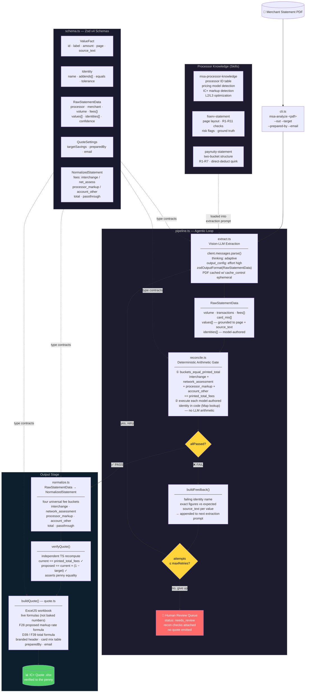

# MSA Quote Engine — System Diagram

## Key design principles

| Layer | Who decides | Who executes |
|---|---|---|
| Extraction | Vision LLM (Claude) — reads PDF visually, no regex | SDK `messages.parse()` + structured outputs |
| Reconciliation identities | LLM — authors which identities apply for this statement | `reconcile.ts` — executes arithmetic exactly |
| Self-correction | `pipeline.ts` — feeds failing checks back as feedback | LLM re-extracts with grounding context |
| Quote math | `verifyQuote()` — TS recompute, penny assertion | ExcelJS live formulas in workbook |

The model **never adds numbers in its head** for verification.  
The code **never decides which identities to check** — it only executes what the model declared.
